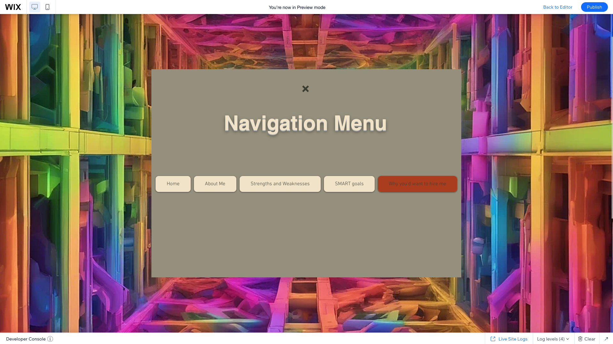

# Git Integration & Wix CLI 

This repo is part of Git Integration & Wix CLI, a set of tools that allows you to write, test, and publish code for your Wix site locally on your computer. 

Connect your site to GitHub, develop in your favorite IDE, test your code in real time, and publish your site from the command line.

Website preview located below auto-generated content

## Set up this repository in your IDE
This repo is connected to a Wix site. That site tracks this repo's default branch. Any code committed and pushed to that branch from your local IDE appears on the site.

Before getting started, make sure you have the following things installed:
* [Git](https://git-scm.com/download)
* [Node](https://nodejs.org/en/download/), version 14.8 or later.
* [npm](https://docs.npmjs.com/downloading-and-installing-node-js-and-npm) or [yarn](https://yarnpkg.com/getting-started/install)
* An SSH key [added to your GitHub account](https://docs.github.com/en/authentication/connecting-to-github-with-ssh/adding-a-new-ssh-key-to-your-github-account).

To set up your local environment and start coding locally, do the following:

1. Open your terminal and navigate to where you want to store the repo.
1. Clone the repo by running `git clone <your-repository-url>`.
1. Navigate to the repo's directory by running `cd <directory-name>`.
1. Install the repo's dependencies by running `npm install` or `yarn install`.
1. Install the Wix CLI by running `npm install -g @wix/cli` or `yarn global add @wix/cli`.  
   Once you've installed the CLI globally, you can use it with any Wix site's repo.

For more information, see [Setting up Git Integration & Wix CLI](https://support.wix.com/en/article/velo-setting-up-git-integration-wix-cli-beta).

## Write Velo code in your IDE
Once your repo is set up, you can write code in it as you would in any other non-Wix project. The repo's file structure matches the [public](https://support.wix.com/en/article/velo-working-with-the-velo-sidebar#public), [backend](https://support.wix.com/en/article/velo-working-with-the-velo-sidebar#backend), and [page code](https://support.wix.com/en/article/velo-working-with-the-velo-sidebar#page-code) sections in Editor X.

Learn more about [this repo's file structure](https://support.wix.com/en/article/velo-understanding-your-sites-github-repository-beta).

## Test your code with the Local Editor
The Local Editor allows you test changes made to your site in real time. The code in your local IDE is synced with the Local Editor, so you can test your changes before committing them to your repo. You can also change the site design in the Local Editor and sync it with your IDE.

Start the Local Editor by navigating to this repo's directory in your terminal and running `wix dev`.

For more information, see [Working with the Local Editor](https://support.wix.com/en/article/velo-working-with-the-local-editor-beta).

## Preview and publish with the Wix CLI
The Wix CLI is a tool that allows you to work with your site locally from your computer's terminal. You can use it to build a preview version of your site and publish it. You can also use the CLI to install [approved npm packages](https://support.wix.com/en/article/velo-working-with-npm-packages) to your site.

Learn more about [working with the Wix CLI](https://support.wix.com/en/article/velo-working-with-the-wix-cli-beta).

## Invite contributors to work with you
Git Integration & Wix CLI extends Editor X's [concurrent editing](https://support.wix.com/en/article/editor-x-about-concurrent-editing) capabilities. Invite other developers as collaborators on your [site](https://support.wix.com/en/article/inviting-people-to-contribute-to-your-site) and your [GitHub repo](https://docs.github.com/en/account-and-profile/setting-up-and-managing-your-personal-account-on-github/managing-access-to-your-personal-repositories/inviting-collaborators-to-a-personal-repository). Multiple developers can work on a site's code at once.

## Website Preview
#### This is so Mr. Hicks can see what the website looks like without sophisitcated local toolchains that he will likely never use.

##### Lightbox page
###### Allows easy navigation of all the website's pages
Lightroom page

##### Page 1-1
###### Gives a basic introduction about what the website is about, and gives a button that links to the first actual page of the website beyond QoL (Quality of Life) and introduction pages
Page 1 section 1

##### Page 2-1
###### The first proper page of the website. Gives a basic introduction of who I am, how to navigate the website, and what I am attempting to acheive with this website
Page 2 section 1

##### Page 2-2
###### Continuation of Page 2. It's not the greatest, but what can you expect from a 17 year old VCE-VM student who likes coding and nothing else?
Page 2 section 2

##### Page 3-1
###### Explains the weaknesses of my personality type (ISTP-T, The Virtuoso), as well as the strengths. Turns out it's not the greatest at working in groups, but is great at adapting quickly, and working when in solitude
Page 3 section 1

##### Page 3-2
###### Continuation of Page 3. It gives my final thoughts on my strengths and weaknesses with my personality type, and how it works in the workplace
Page 3 section 2

##### Page 4-1
###### Shows my SMART goals. in a <em><strong>big</strong></em>, <em><strong>*fancy*</em></strong> box.
Page 4 section 1

##### Page 4-2
###### Shows my finals thoughts involving this topic, including a quick rundown of what SMART goals are, and what I think of them
Page 4 section 2

##### Page 5-1
###### A quick couple of paragraphs explaining why I think I would be a valuable asset in the workplace, given my peculiarities and traits
Page 5 section 1

##### Page 5-2
###### Just a quick continuation of Page 5 to include the short couple of lines I couldn't fit on the screen. The 16:9 aspect ratio can sometimes be a pain
Page 5 section 2

Overall, I think I did an alright job with this website. Could it be better? Yes. Is this website completely serious? Absolutely not. If this was more official, and I actually had the money to deploy it, I would've put a bit more effort into it. At the end of the day, this is just a silly litte school project that I wouldn't be doing without the order of the great at terrible Mr. Hicks.

(I don't mean that as an insult, you just terrify me. With a bamboo cane, and a relentless look that implies that you're always ready to beat a child black and blue for spitting at Little Johnny, I think you'd be a perfect headmaster. Forced piety does some weird things to people).

I can't say how Mr. Hicks terrifies me to no end without saying how great of a techer he is. Gigantism and stern looks aside, you are an amazing teacher. Keep doing what you're doing, you have some great years ahead of you, I just know it. :)

